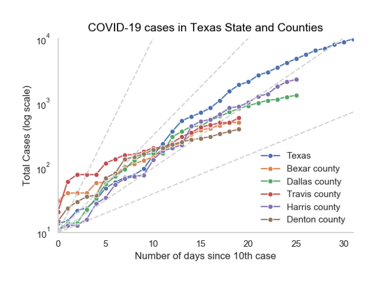
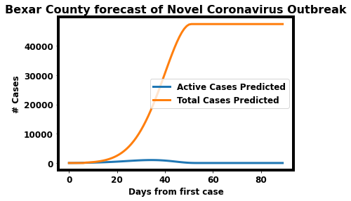

[](https://zenodo.org/badge/latestdoi/248896172)

# Livid about COVID
COVID-19 has impacted the State of Texas and the world in unprecedented ways. The goal of
our work is to help the City of San Antonio and the State of Texas in understanding the spread 
of the COVID-19 pandemic. We have designed a generic AI model for forecasting the spread of the
COVID-19 pandemic across the world. The region-specific models are designed to help local
government and the public better plan during the crisis, so as to facilitate a speedy recovery.
Because population dynamics differ between metropolitan areas, region-specific models can offer
additional insights. We present some preliminary results on forecasting the spread of the
COVID-19 disease by the SARS-CoV-2 virus on various scales.

*If you would like to use this work*, please reference this GitHub repository by the Zenodo
citation in the top of this README.



This figure illustrates the trajectories for the total number of active cases in different
counties in Texas, where _Bexar County cases are doubling every ~2-3 days_. It is critical
to flatten these curves by continuing and reinforcing the social distancing measures.
The stars in the plot indicate the specific days when social distancing was implemented 
in the respective county. Data sources: CDC, European CDC, NYTimes, and Texas DSHS.

## Installation
The code in this repository was developed for Python 3.5 and above. To install dependency
packages, run the following. 

```bash
pip install -r requirements.txt
```

Change the `tensorflow-x` line in `requirements.txt` depending on whether you will be running on
CPU or GPU.

## Forecasting the Reach of the COVID-19 Disease
See the `notebooks` folder for our codebase. Currently, we use the daily case data from China
to predict the proceeding quantity of active and total cases several days in advance. We use
a deep learning recurrent architecture to integrate a sequence of previous days to make
predictions on the days to come. For further details please see the Jupyter notebooks.

Sample results (preliminary) for Bexar County, TX, USA.



## Types of Data
1. Confirmed Cases
2. Deaths
3. Recoveries
    1. By country
    2. By province/state (for few)
    3. By county (for US)
