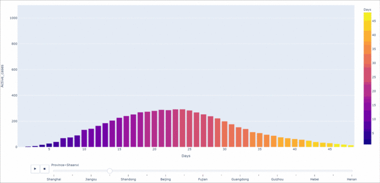
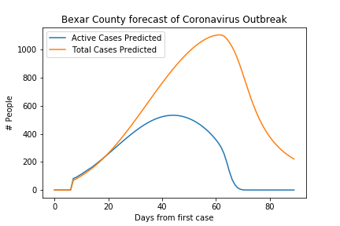
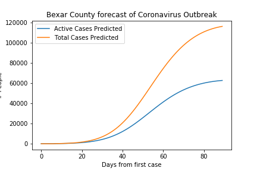
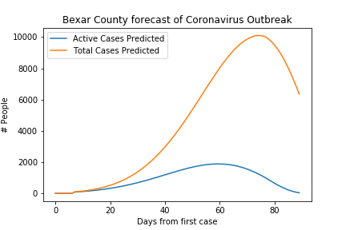

# Livid about COVID
We present some preliminary results on forecasting the spread of the COVID-19 disease by
the SARS-CoV-2 virus.

*If you would like to use this work*, please reference this GitHub repository by the Zenodo
citation in the top of this README.

## Forecasting the Reach of the COVID-19 Disease
See the `notebooks` folder for our codebase. Currently, we use the daily case data from China
to predict the proceeding quantity of active and total cases several days in advance. We use
a deep learning recurrent architecture to integrate a sequence of previous days to make
predictions on the days to come. For further details please see the Jupyter notebooks.

## Types of Data
1. Confirmed Cases
2. Deaths
3. Recoveries
    1. By country
    2. By province/state (for few)
    3. By county (for US)
